# ESG Reporting Engine Backend

## Project Overview

The ESG Reporting Engine Backend is a Spring Boot–based REST API application designed to manage Environmental, Social, and Governance (ESG) reporting data efficiently and securely.

The application provides scalable backend services for creating, updating, deleting, and managing ESG records with PostgreSQL database integration and JWT-based authentication.

This project follows a clean layered architecture using Spring Boot best practices and includes Swagger/OpenAPI documentation for API testing and development.

---

# Features

- CRUD Operations for ESG Records
- JWT Authentication & Authorization
- PostgreSQL Database Integration
- RESTful API Architecture
- Swagger/OpenAPI Documentation
- Request Validation using Spring Validation
- Spring Security Integration
- Layered Backend Structure
- Maven Dependency Management
- Exception Handling & Validation

---

# Tech Stack

| Technology | Purpose |
|---|---|
| Java 17 | Backend Language |
| Spring Boot | Backend Framework |
| Spring Security | Authentication & Security |
| Spring Data JPA | ORM Layer |
| PostgreSQL | Database |
| Maven | Dependency Management |
| Swagger/OpenAPI | API Documentation |
| JWT | Authentication |
| Lombok | Boilerplate Reduction |
| Spring Validation | Request Validation |

---

# Project Structure

```text
backend
│
├── src
│   └── main
│       ├── java
│       │   └── tool
│       │       ├── controller
│       │       ├── dto
│       │       ├── entity
│       │       ├── repository
│       │       ├── security
│       │       ├── service
│       │       └── ToolApplication.java
│       │
│       └── resources
│           └── application.properties
│
├── pom.xml
├── mvnw
└── mvnw.cmd
```

---

# Database Configuration

Update the following properties in:

```properties
src/main/resources/application.properties
```

```properties
spring.datasource.url=jdbc:postgresql://localhost:5432/esgdb
spring.datasource.username=postgres
spring.datasource.password=postgres
```

---

# API Documentation

Swagger UI:

```text
http://localhost:8080/swagger-ui/index.html
```

---

# Getting Started

## Clone Repository

```bash
git clone https://github.com/nbhoomi567-hash/esg-reporting-engine.git
```

---

## Navigate to Backend

```bash
cd backend
```

---

## Build Project

```bash
./mvnw clean install
```

For Windows PowerShell:

```powershell
.\mvnw.cmd clean install
```

---

## Run Application

```bash
./mvnw spring-boot:run
```

For Windows PowerShell:

```powershell
.\mvnw.cmd spring-boot:run
```
# Project Screenshots

## Authentication API


## Authorization Test 1
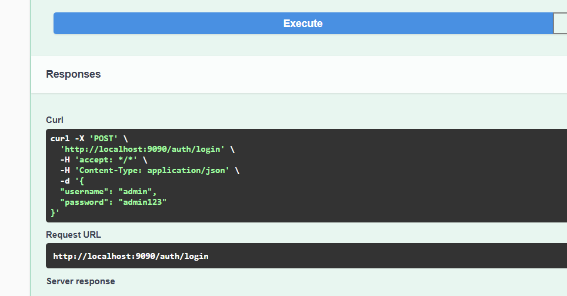

## Authorization Test 2
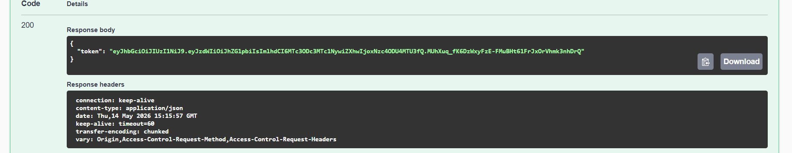

## Search By Company
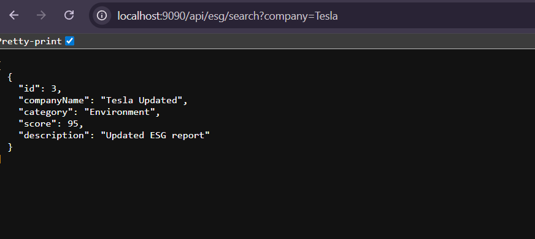

## Database Records
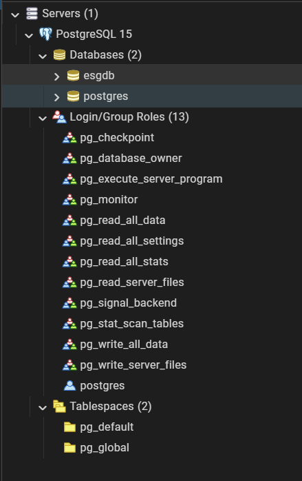

## Delete API Output
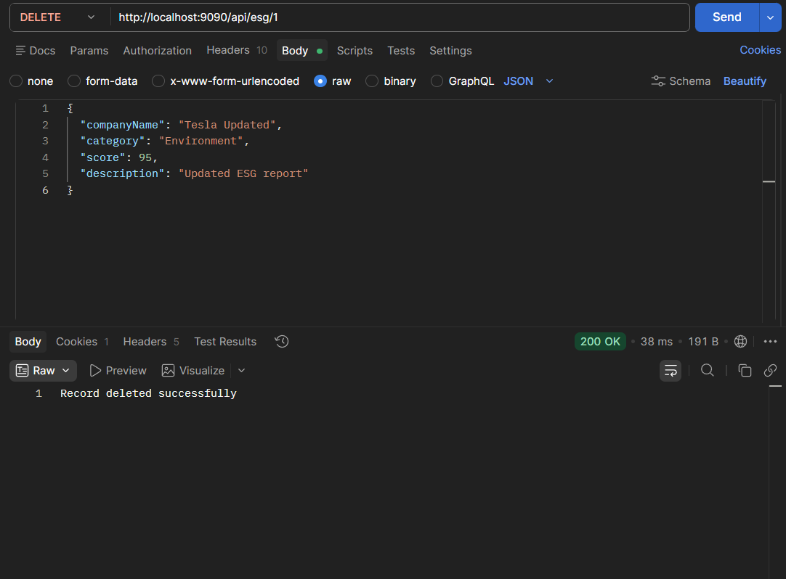

## Get By ID
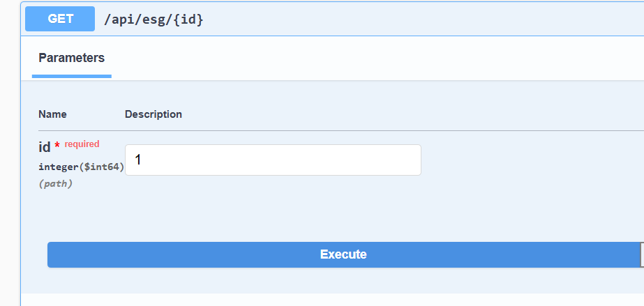

## Get By ID Output
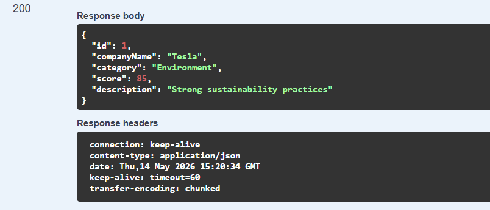

## GET API
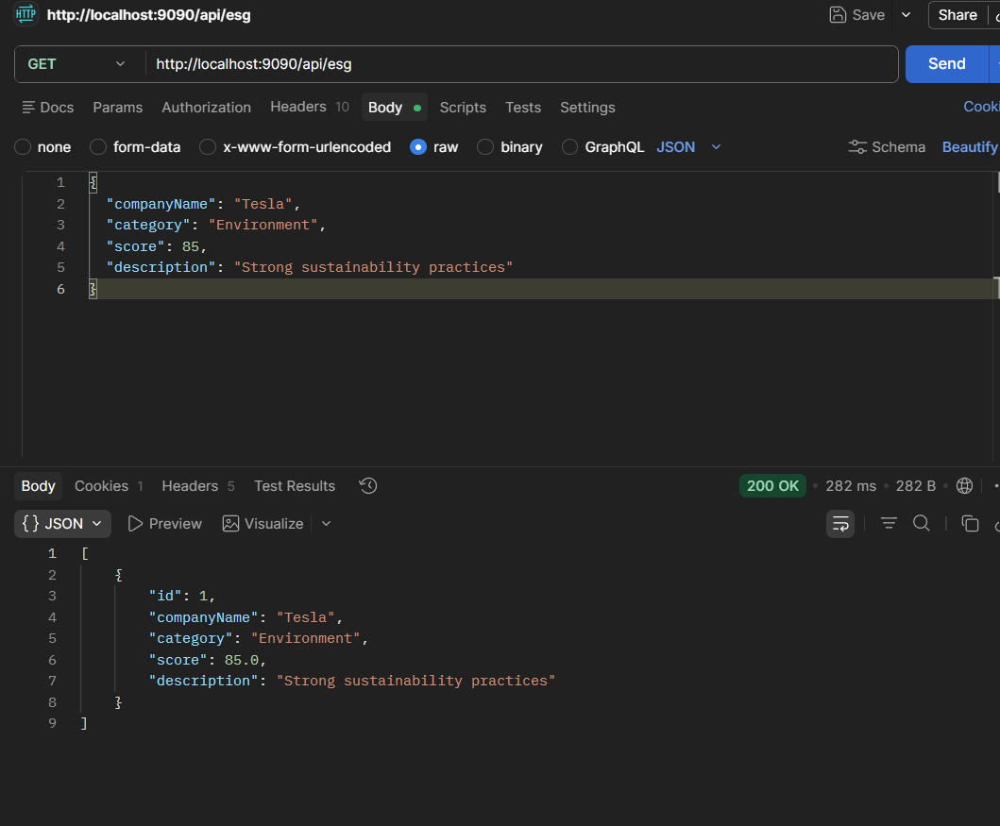

## Login Page
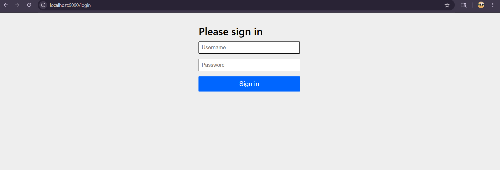

## API Method Check
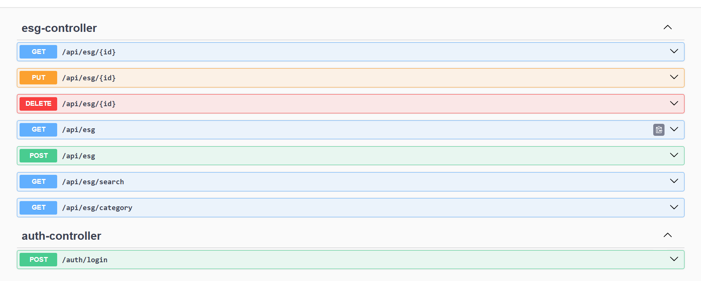

## POST Check Output
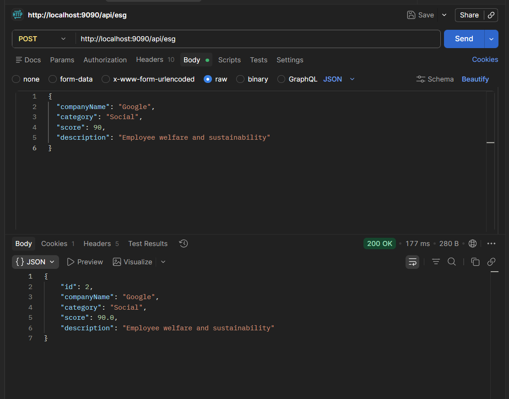

## POST API
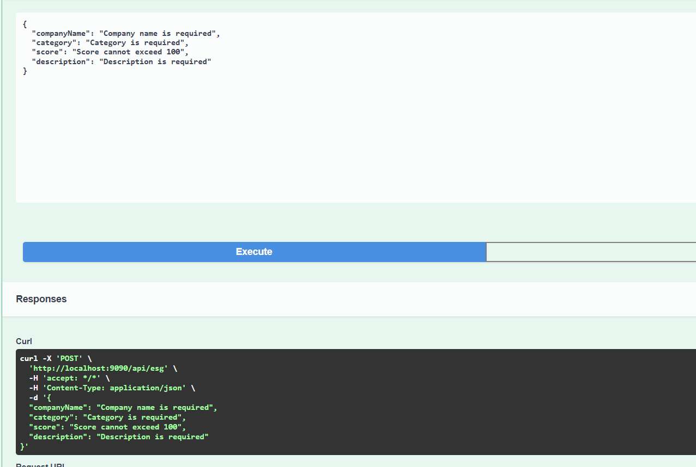

## Project Structure
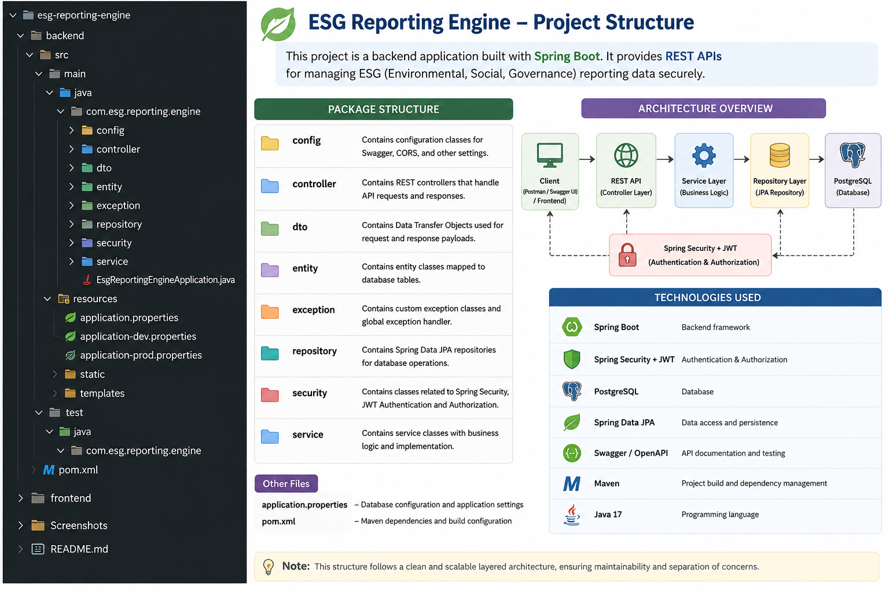

## Search By Category
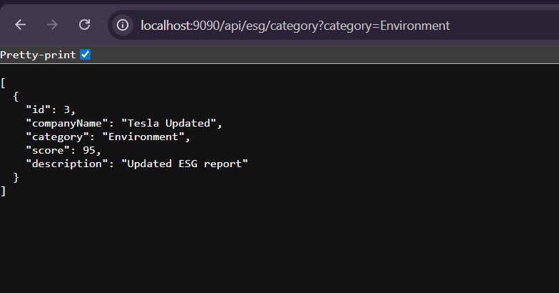

## Swagger UI Test 1
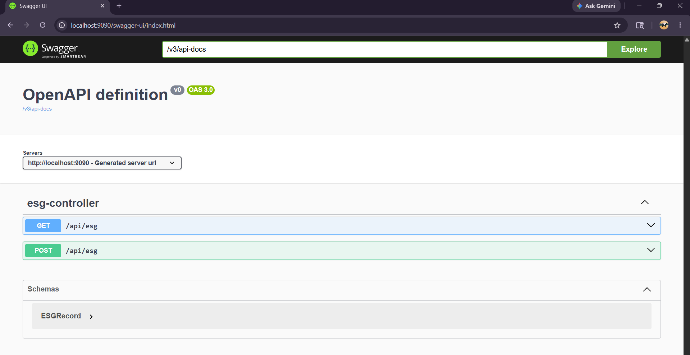

## Swagger UI Test 2
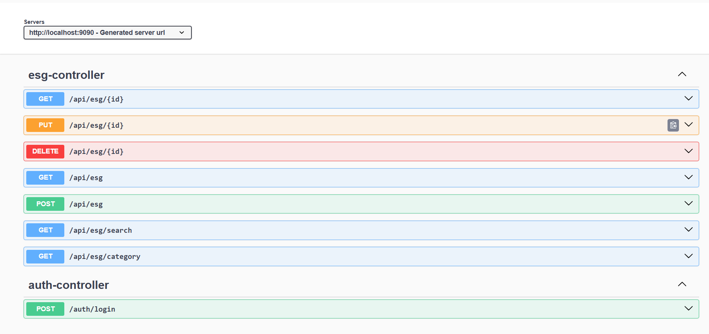
---

# Authentication

The application uses JWT (JSON Web Token) authentication for securing APIs.

Features include:

- Token Generation
- Token Validation
- Secured API Endpoints
- Spring Security Integration

---

# Future Enhancements

- Role-Based Access Control (RBAC)
- Docker Deployment
- Cloud Deployment Support
- ESG Analytics Dashboard
- AI-Based ESG Insights
- Advanced Reporting Features

---

# Author

Developed as part of ESG Reporting Engine Backend implementation using Spring Boot and PostgreSQL.

---

# License

This project is developed for educational and internship purposes.
